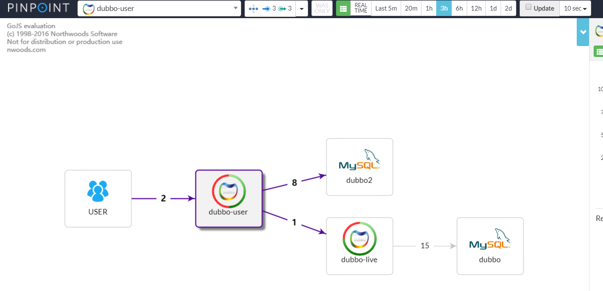
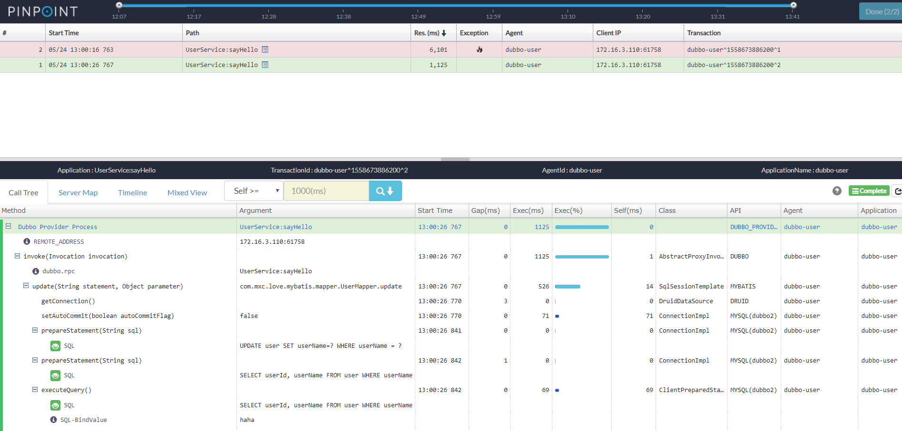

### dubbo2.7.1的pinpoint1.8.3的插件

因为官网的插件是老版本的dubbo不支持新版本 所以修改了包名就能用了

### 安装核心类到本地 在jars目录

mvn install:install-file -Dfile=pinpoint-bootstrap-core-1.8.3.jar -DgroupId=com.navercorp.pinpoint -DartifactId=pinpoint-bootstrap-core -Dversion=1.8.3 -Dpackaging=jar

mvn install:install-file -Dfile=pinpoint-commons-1.8.3.jar -DgroupId=com.navercorp.pinpoint -DartifactId=pinpoint-commons -Dversion=1.8.3 -Dpackaging=jar

### 部署一下呀

替换D:\Asd\pinpoint-agent-1.8.3\plugin中的pinpoint-dubbo-plugin-1.8.3.jar

